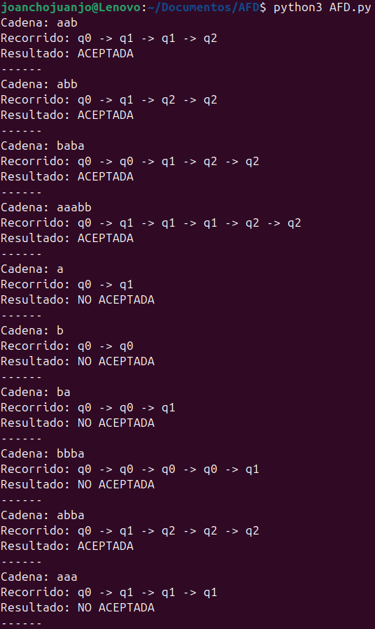
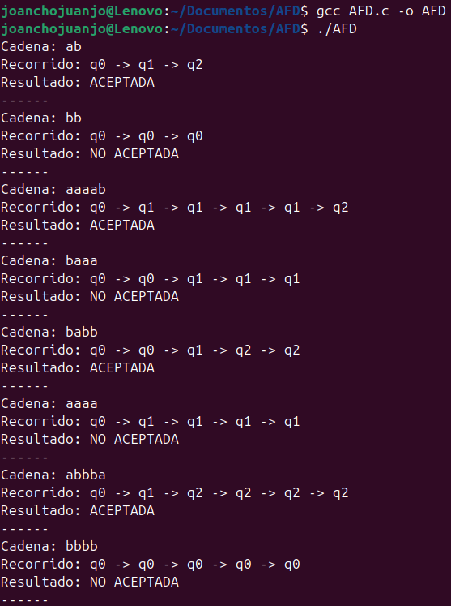

# DISEÑO E IMPLEMENTACIÓN DE UN AFD (PYTHON Y C)

Este proyecto implementa un Autómata Finito Determinista (AFD) en dos lenguajes: Python y C. A partir de un archivo de configuración que define estados, alfabeto, transiciones y estados de aceptación, el programa procesa un conjunto de cadenas de prueba y determina el recorrido de estados y si cada cadena es aceptada o rechazada.

## Configuración y Cadenas que lee y toma en cuenta cada código.

<pre>
# Estados
Q = {'q0', 'q1', 'q2'}

# Alfabeto
ALFABETO = {'a', 'b'}

# Estado inicial
q0

# Estados de aceptación
F = {q2}

# Transiciones (estado, símbolo -> nuevo estado)
q0,a->q1
q0,b->q0
q1,a->q1
q1,b->q2
q2,a->q2
q2,b->q2  
</pre>

    
### Cadenas en Python
<pre>
aab       # aceptada
abb       # aceptada
baba      # aceptada
aaabb     # aceptada
a         # no aceptada (termina en q1)
b         # no aceptada (termina en q0)
ba        # no aceptada (q0 -> q0 -> q1)
bbba      # aceptada (q0 -> q0 -> q0 -> q0 -> q1)
abba      # aceptada (q0 -> q1 -> q2 -> q2 -> q2)
aaa       # no aceptada (q0 -> q1 -> q1 -> q1)
</pre>
### Cadenas en C
<pre>    
ab        # aceptada  (q0 → q1 → q2)
bb        # no aceptada (q0 → q0 → q0)
aaaab     # aceptada  (q0 → q1 → q1 → q1 → q1 → q2)
baaa      # no aceptada (q0 → q0 → q1 → q1 → q1)
babb      # aceptada  (q0 → q0 → q1 → q2 → q2)
aaaa      # no aceptada (q0 → q1 → q1 → q1 → q1)
abbba     # aceptada  (q0 → q1 → q2 → q2 → q2 → q2)
bbbb      # no aceptada (q0 → q0 → q0 → q0 → q0)
</pre>    

## Python

En la versión en Python se implementa un Autómata Finito Determinista (AFD) que lee la configuración del autómata y un conjunto de cadenas desde archivos de texto, y luego muestra el recorrido de estados junto con la aceptación o rechazo de cada cadena.

<pre>

def cargar_afd(archivo):
    with open(archivo, 'r') as f:
        lineas = [l.strip() for l in f if l.strip() and not l.startswith("#")]

    estados = set(lineas[0].split("=")[1].replace("{", "").replace("}", "").split(","))
    estados = {e.strip() for e in estados if e.strip()}

    alfabeto = set(lineas[1].split("=")[1].replace("{", "").replace("}", "").split(","))
    alfabeto = {a.strip() for a in alfabeto if a.strip()}

    estado_inicial = lineas[2].strip()

    estados_aceptacion = set(lineas[3].split("=")[1].replace("{", "").replace("}", "").split(","))
    estados_aceptacion = {e.strip() for e in estados_aceptacion if e.strip()}

    transiciones = {}
    for regla in lineas[4:]:
        izq, der = regla.split("->")
        estado, simbolo = izq.split(",")
        transiciones[(estado.strip(), simbolo.strip())] = der.strip()

    return estados, alfabeto, estado_inicial, estados_aceptacion, transiciones

def procesar_cadena(cadena, estado_inicial, transiciones, estados_aceptacion):
    estado_actual = estado_inicial
    recorrido = [estado_actual]

    for simbolo in cadena:
        if (estado_actual, simbolo) in transiciones:
            estado_actual = transiciones[(estado_actual, simbolo)]
            recorrido.append(estado_actual)
        else:
            recorrido.append("ERROR")
            return recorrido, False

    return recorrido, estado_actual in estados_aceptacion

if __name__ == "__main__":
    estados, alfabeto, estado_inicial, estados_aceptacion, transiciones = cargar_afd("config.txt")

    with open("cadenas.txt", "r") as f:
        cadenas = [linea.strip() for linea in f if linea.strip()]

    for cadena in cadenas:
        recorrido, aceptada = procesar_cadena(cadena, estado_inicial, transiciones, estados_aceptacion)
        print(f"Cadena: {cadena}")
        print(f"Recorrido: {' -> '.join(recorrido)}")
        print("Resultado:", "ACEPTADA" if aceptada else "NO ACEPTADA")
        print("------")

</pre>

A continuación, podemos ver la salida por consola, donde nos muestra la cadena, el recorrido que esta hace, y por último si, con base en las reglas, es aceptada o no.

## C

En la versión en C se desarrolla la misma lógica, pero con un manejo manual de cadenas y estructuras, mostrando cómo leer archivos de configuración y aplicar transiciones de forma más explícita en bajo nivel.

<pre>

#include <stdio.h>
#include <stdlib.h>
#include <string.h>

#define MAX_ESTADOS 50
#define MAX_TRANSICIONES 200
#define MAX_CADENA 200

typedef struct {
    char estado[20];
} Estado;

typedef struct {
    char origen[20];
    char simbolo;
    char destino[20];
} Transicion;

Estado estados[MAX_ESTADOS];
int numEstados = 0;

char alfabeto[50];
int numSimbolos = 0;

char estadoInicial[20];
Estado estadosAceptacion[MAX_ESTADOS];
int numAceptacion = 0;

Transicion transiciones[MAX_TRANSICIONES];
int numTransiciones = 0;

void cargarAFD(const char *archivo) {
    FILE *f = fopen(archivo, "r");
    if (!f) {
        perror("No se pudo abrir config.txt");
        exit(1);
    }

    char linea[256];
    while (fgets(linea, sizeof(linea), f)) {
        if (linea[0] == '#' || strlen(linea) < 2) continue;

        if (linea[0] == 'Q') {
            char *p = strchr(linea, '{');
            char *q = strchr(linea, '}');
            *q = '\0';
            p++;
            char *token = strtok(p, ",");
            while (token) {
                strcpy(estados[numEstados++].estado, token);
                token = strtok(NULL, ",");
            }
        } else if (strncmp(linea, "ALFABETO", 8) == 0) {
            char *p = strchr(linea, '{');
            char *q = strchr(linea, '}');
            *q = '\0';
            p++;
            char *token = strtok(p, ",");
            while (token) {
                alfabeto[numSimbolos++] = token[0];
                token = strtok(NULL, ",");
            }
        } else if (linea[0] == 'F') {
            char *p = strchr(linea, '{');
            char *q = strchr(linea, '}');
            *q = '\0';
            p++;
            char *token = strtok(p, ",");
            while (token) {
                strcpy(estadosAceptacion[numAceptacion++].estado, token);
                token = strtok(NULL, ",");
            }
        } else if (strchr(linea, ',') && strchr(linea, '-')) {
            char izq[50], der[50];
            sscanf(linea, "%[^-]->%s", izq, der);
            char *coma = strchr(izq, ',');
            *coma = '\0';
            strcpy(transiciones[numTransiciones].origen, izq);
            transiciones[numTransiciones].simbolo = *(coma + 1);
            strcpy(transiciones[numTransiciones].destino, der);
            numTransiciones++;
        } else {
            strcpy(estadoInicial, linea);
            estadoInicial[strcspn(estadoInicial, "\n")] = 0;
        }
    }

    fclose(f);
}

const char* mover(const char *estado, char simbolo) {
    for (int i = 0; i < numTransiciones; i++) {
        if (strcmp(transiciones[i].origen, estado) == 0 && transiciones[i].simbolo == simbolo) {
            return transiciones[i].destino;
        }
    }
    return NULL;
}

int esAceptacion(const char *estado) {
    for (int i = 0; i < numAceptacion; i++) {
        if (strcmp(estadosAceptacion[i].estado, estado) == 0) return 1;
    }
    return 0;
}

void procesarCadena(const char *cadena) {
    const char *estado = estadoInicial;
    printf("Cadena: %s\n", cadena);
    printf("Recorrido: %s", estado);

    for (int i = 0; i < strlen(cadena); i++) {
        estado = mover(estado, cadena[i]);
        if (!estado) {
            printf(" -> ERROR\nResultado: NO ACEPTADA\n------\n");
            return;
        }
        printf(" -> %s", estado);
    }
    printf("\nResultado: %s\n------\n", esAceptacion(estado) ? "ACEPTADA" : "NO ACEPTADA");
}

int main() {
    cargarAFD("config.txt");

    FILE *f = fopen("cadenasc.txt", "r");
    if (!f) {
        perror("No se pudo abrir cadenas.txt");
        exit(1);
    }

    char cadena[MAX_CADENA];
    while (fgets(cadena, sizeof(cadena), f)) {
        cadena[strcspn(cadena, "\n")] = 0;
        if (strlen(cadena) > 0) {
            procesarCadena(cadena);
        }
    }

    fclose(f);
    return 0;
}
    
    
</pre>

A continuación, podemos ver la salida por consola, donde nos muestra la cadena, el recorrido que esta hace, y por último si, con base en las reglas, es aceptada o no.

